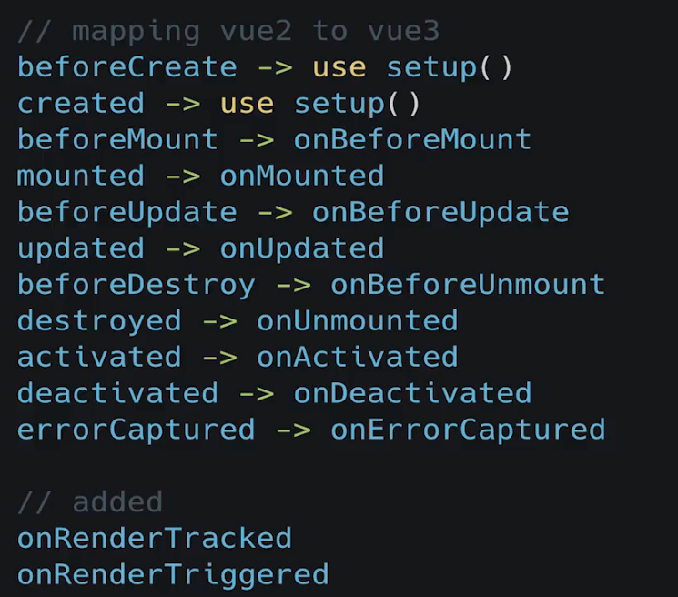

# vue3-zhihu
- 仿知乎网站
- 技术栈： vue@3 + TypeScript + 
- 使用@vue/vli脚手架创建
- 技术：
  - aa
  - bb

## script
``` bash
npm install
npm run serve
npm run build
# Lints and fixes files
npm run lint 
```
## 项目文档
- [文档：http://docs.vikingship.xyz](http://docs.vikingship.xyz)
## 工具版本
- node@12.5.0
- @vue/cli@4.5.4
- vite@2.8.5
## vue2中的存在的一些问题
- 组件间的复用逻辑经常需要mixin来实现，阅读组件的时候会对一些变量觉得莫名其妙
- 

## 编辑器插件推荐
- vue2：vetur   
- vue3：volar

## 生命周期钩子



## 样式库选型
- bootStrap
- tailwindcss

## 服务接口
- [Dog API](https://dog.ceo/dog-api/breeds-list)
- 
